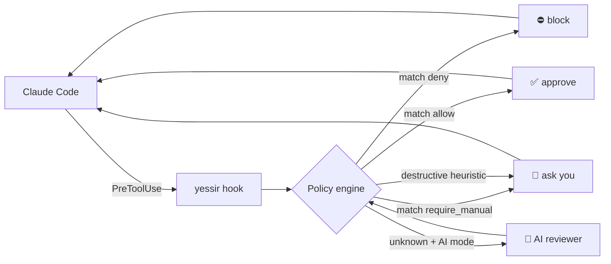
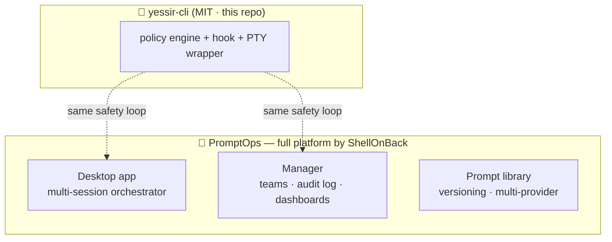

<div align="center">

```
             ██╗   ██╗███████╗███████╗███████╗██╗██████╗
             ╚██╗ ██╔╝██╔════╝██╔════╝██╔════╝██║██╔══██╗
              ╚████╔╝ █████╗  ███████╗███████╗██║██████╔╝
               ╚██╔╝  ██╔══╝  ╚════██║╚════██║██║██╔══██╗
                ██║   ███████╗███████║███████║██║██║  ██║
                ╚═╝   ╚══════╝╚══════╝╚══════╝╚═╝╚═╝  ╚═╝
                the safety layer for autonomous coding agents
```

# 🫡 `yessir-cli`

**Let AI coding agents work. Keep the dangerous decisions yours.**

Yessir runs next to your terminal agent and answers all the boring “are you sure?” prompts for you —
while blocking the ones that could wreck your repo. 🛡️

> 🧬 **Yessir is the OSS spin-off of the safety layer that powers
> [PromptOps](https://promptops.it) — the full AI-agent orchestration
> platform by [ShellOnBack](https://shellonback.com).**
> We pulled the part that every developer needs into its own MIT-licensed
> CLI. No account, no cloud, no UI.

[](https://github.com/shellonback/yessir-cli/actions/workflows/ci.yml)
[](https://nodejs.org)
[](./LICENSE)
[](#-tests)
[](./package.json)
[](https://promptops.it)
[](https://shellonback.com)

[Quick start](#-quick-start) · [How it works](#-how-it-works) · [Policy](#-policy) · [Modes](#-modes) · [PromptOps](#-part-of-the-promptops-family) · [FAQ](#-faq)

</div>

---

## ✨ Why Yessir?

Coding agents are fast — until they stop every 30 seconds to ask:

> 🤖 *“Can I run `npm test`?”*
> 🤖 *“Should I read `package.json`?”*
> 🤖 *“Do you want me to commit this?”*

You have two bad options today:

- 😴 babysit every prompt and waste your focus, or
- 🙈 turn on *dangerously-skip-permissions* and pray the model isn't having a bad day.

**Yessir is the third way.**
It reads your project's policy file, approves the boring stuff instantly,
blocks the dangerous stuff deterministically, and escalates to you only when
a human judgement actually matters. 🎯

---

## 🚀 Quick start

```bash
npx yessir-cli init --hook
```

That's it. Now:

1. 📝 `.yessir/yessir.yml` is a conservative default policy (editable, commit it).
2. 🪝 `.claude/settings.json` wires a `PreToolUse` hook into **Claude Code**.
3. 🏃 Every active and future Claude Code session in this project follows the policy automatically.

Open Claude Code and watch it stop asking. 🤫

<details>
<summary>💡 Prefer to wrap the CLI instead of using the hook?</summary>

```bash
npx yessir-cli claude     # wrap Claude Code in a managed PTY
npx yessir-cli codex      # same, for OpenAI Codex
npx yessir-cli gemini     # same, for Gemini CLI
npx yessir-cli -- aider   # generic wrapper for any interactive agent
```

Useful when a provider doesn't support hooks, or when you want the wrapper to
also tail the terminal for heuristic detection.

</details>

---

## 🎬 What it looks like

```
$ yessir claude

🫡 Claude wants to run: npm test
    Policy: allow.commands → "npm test"
    Decision: ✅ APPROVED  (3ms, deterministic)

🫡 Claude wants to edit: src/auth/login.ts
    Policy: allow.write → "src/**"
    Decision: ✅ APPROVED

🫡 Claude wants to run: git push --force origin main
    Policy: deny.commands → "git push --force *"
    Decision: ⛔ BLOCKED  (conservative by design)

🫡 Claude asks: "Should I also update the snapshot files?"
    Context tail: 212 lines
    Decision: 🙋 ESCALATED to you  (open question, AI reviewer disabled)
```

---

## 🧠 How it works

<div align="center">



</div>

**Precedence** (highest wins):

1. 🔴 `deny`
2. 🟡 `require_manual`
3. 🧨 destructive heuristics — `rm -rf`, `sudo`, `curl | bash`, shell metacharacters
4. 🟢 `allow`
5. ❓ unknown → AI reviewer in `hybrid`/`ai` mode, otherwise escalated to you

> 🧱 Deny rules always override allow rules. Unknown destructive commands are
> **never** silently approved.

---

## 📜 Policy

Generated by `yessir init`, lives at `.yessir/yessir.yml`, commits with your repo.

```yaml
mode: hybrid

allow:
  commands:
    - git status
    - git diff *
    - npm test
    - npm run test *
    - npm run lint
  read:
    - "**/*"
  write:
    - src/**
    - tests/**

deny:
  commands:
    - rm -rf *
    - sudo *
    - git push --force *
    - curl * | bash
    - npm publish

require_manual:
  commands:
    - git push
    - git push *
    - docker compose up *
    - npm install *

ai_reply:
  enabled: true
  model: auto
  max_tail_lines: 300
```

### Pattern rules (short version)

| Where          | `*` means                                | Example                                                           |
| -------------- | ---------------------------------------- | ----------------------------------------------------------------- |
| `commands`     | any run of non-shell-metachars           | `git diff *` matches `git diff HEAD` but NOT `git diff && rm -rf` |
| `read`/`write` | any run of non-slash chars (glob)        | `src/**` matches `src/a/b/c.ts`                                   |
| `?`            | single non-slash char                    | `file?.txt` matches `file1.txt`                                   |
| shell chars    | `\|`, `&`, `;`, `<`, `>`, backtick, `$` are **dangerous** — only allowed when a rule matches the exact pipeline |                                                                   |

---

## ⚙️ Modes

| Mode          | Who decides                                          | Latency | Token cost |
| ------------- | ---------------------------------------------------- | ------- | ---------- |
| `quick`       | policy only                                          | ⚡ ~1ms  | 0          |
| `hybrid` ⭐   | policy for known, AI reviewer for ambiguous (default) | ⚡/🤖    | tiny       |
| `ai`          | AI reviewer on every ambiguous decision              | 🤖      | per-call   |

```bash
yessir claude --mode quick      # zero AI calls
yessir claude --mode hybrid     # default
yessir claude --mode ai         # everything through the reviewer
yessir claude --dry-run         # see decisions without injecting anything
```

---

## 🧩 Plugging your own AI reviewer

The default reviewer is a `NoopReviewer` that always escalates (safe default).
Swap in your model of choice:

```ts
import { AiReviewer, ReviewerInput, ReviewerOutput } from 'yessir-cli';

export class OpenAiReviewer implements AiReviewer {
  readonly name = 'openai';
  async review(input: ReviewerInput): Promise<ReviewerOutput> {
    // call your model ...
    return { decision: 'approve', reason: 'non-destructive read on tests/' };
  }
}
```

🔒 Context passed to your reviewer is first run through `redactSecrets`
(API keys, GitHub tokens, AWS keys, PEM blocks — masked before leaving
the process).

---

## 🛡️ Safety principles

- 🏠 **Local-first.** Policy stays in your repo. No cloud proxy. No hosted runtime.
- 📦 **Zero runtime dependencies.** The whole safety layer is auditable in an afternoon.
- 🚫 **Deny always wins.** If two rules match, the deny one decides.
- 🧨 **Destructive-by-heuristic stays manual.** `rm -rf`, `sudo`, pipes-to-bash, unknown shell metacharacters — none of those get auto-approved.
- 🤖 **The AI reviewer never runs commands.** It returns a decision; the engine enforces it.
- 🔐 **Secrets redacted** before any context leaves the process.
- 🗂️ **Append-only decision log** at `.yessir/yessir.log`.

---

## 🗺️ Architecture

```
bin/                 thin launcher
src/
  cli.ts             argv → command dispatcher
  commands/          init · hook · run · doctor · explain
  policy/            yaml parser · loader · matchers · engine
  detector/          provider adapters (claude · codex · gemini · generic)
  tailer/            rolling buffer + ANSI strip
  writer/            PTY write with y-streak + cooldown guardrails
  hook/              Claude Code PreToolUse JSON adapter
  ai/                reviewer interface · noop · secret redaction
  pty/               node-pty wrapper (lazy-loaded, optional dep)
  util/              append-only file logger
templates/           default .yessir/yessir.yml
test/                node --test suites (86 tests)
```

---

## 🧪 Tests

```bash
git clone https://github.com/shellonback/yessir-cli.git
cd yessir-cli
npm install
npm test
```

86 tests covering policy matching, engine decisions, YAML parsing,
tailer bounds, detector regex, writer concurrency, hook I/O, init
idempotence, CLI argv parsing. CI runs on Ubuntu + macOS × Node 18/20/22.

---

## 🗓️ Roadmap

- [x] Claude Code `PreToolUse` hook adapter
- [x] PTY wrapper for Claude / Codex / Gemini / generic agents
- [x] YAML policy engine with deny-wins precedence
- [x] Pluggable AI reviewer + secret redaction
- [ ] 🧷 Native provider for OpenAI + Anthropic reviewers
- [ ] 🌍 `yessir doctor --fix` auto-remediation
- [ ] 📊 Opt-in local decision dashboard
- [ ] 🪟 Windows PTY fallback via ConPTY
- [ ] 🔌 Remote policy include (`extends: github:shellonback/yessir-rules`)

Have an idea? [Open an issue](https://github.com/shellonback/yessir-cli/issues/new) — PRs warmly welcomed. 💚

---

## 🧬 Part of the PromptOps family

Yessir was born as a single module inside **[PromptOps](https://promptops.it)**,
the full AI-agent orchestration platform by [ShellOnBack](https://shellonback.com).
We extracted it because every developer running Claude Code, Codex or Gemini
deserves the safety layer — even without the rest of the product. 🫡

<div align="center">

| What you need                                              | Use this                                                                     |
| ---------------------------------------------------------- | ---------------------------------------------------------------------------- |
| 🫡 Auto-approve safe commands in your terminal (free, OSS) | **`yessir-cli`** (you are here)                                              |
| 🧠 A desktop app for running many agent sessions at once   | **[PromptOps Desktop](https://promptops.it/download)**                       |
| 🏢 Team policies, audit log, dashboards, trust zones       | **[PromptOps Manager](https://promptops.it)**                                |
| 📚 Prompt library, versioning, multi-provider routing      | **[promptops.it](https://promptops.it)**                                     |
| 📖 Guides on prompt engineering & agent orchestration      | **[promptops.it/guide](https://promptops.it/guide)**                         |
| 📰 What's new                                              | **[promptops.it/changelog](https://promptops.it/changelog)**                 |

</div>



The policy engine, the `PreToolUse` hook adapter and the PTY writer are the
exact same building blocks used inside PromptOps — just trimmed down to zero
runtime dependencies and released under MIT so you can drop them into any repo.

🔗 Useful PromptOps links:

- 🌐 Landing — **<https://promptops.it>**
- 📥 Desktop download — **<https://promptops.it/download>**
- 📚 Guides — **<https://promptops.it/guide>**
- 📰 Changelog — **<https://promptops.it/changelog>**
- 📄 Docs — **<https://promptops.it/docs>**
- 🧰 LLM-friendly docs — **<https://promptops.it/llms-full.txt>**
- 🧑‍💻 Built by ShellOnBack — **<https://shellonback.com>**

---

## ❓ FAQ

<details>
<summary><b>Where does Yessir come from?</b></summary>

Yessir is the OSS spin-off of the safety module inside
<b><a href="https://promptops.it">PromptOps</a></b>, the full
AI-agent orchestration platform by
<b><a href="https://shellonback.com">ShellOnBack</a></b>
(desktop app, manager, audit log, dashboards, team policies, prompt library,
multi-provider routing, etc).
<br><br>
The policy engine, the <code>PreToolUse</code> hook adapter and the PTY
writer are literally the same building blocks PromptOps uses under the
hood — we just extracted them, dropped every non-essential dependency,
and shipped them under MIT so you can drop the safety layer into any repo
without signing up for anything. If you end up wanting the orchestrator,
the audit log, or team policies on top of it, that lives at
<a href="https://promptops.it">promptops.it</a>.

</details>

<details>
<summary><b>Should I use Yessir or PromptOps?</b></summary>

Start with Yessir. It's free, local, and takes one command to set up.
When you outgrow "one policy file per repo" and start asking for shared
team rules, audit log, dashboards, or a desktop app that runs multiple
agents in parallel, that's when <a href="https://promptops.it">PromptOps</a>
becomes useful — and it keeps the same safety guarantees because it uses
the same engine.

</details>

<details>
<summary><b>Does it send my code to a cloud service?</b></summary>

No. Hook and wrapper modes are entirely local. If you plug in an AI reviewer,
you control where the context goes — and secrets are redacted first.

</details>

<details>
<summary><b>Can I use it without Claude Code?</b></summary>

Yes. `yessir -- <any interactive CLI>` wraps any terminal tool in a managed PTY
with the same policy engine — Aider, a bare shell, your custom agent, etc.

</details>

<details>
<summary><b>Is it a sandbox?</b></summary>

No. Yessir is a <i>policy</i> layer. It reduces the blast radius of casual
agent misbehavior; it does not replace OS-level sandboxing (Docker, seatbelt,
bubblewrap). Defence in depth is welcome.

</details>

<details>
<summary><b>What if the policy file is missing or broken?</b></summary>

Yessir refuses to silently degrade. A malformed policy causes the hook to
return <code>ask</code> (escalates to you) with a clear error in
<code>.yessir/yessir.log</code>. Unknown commands in <code>quick</code> mode
also default to escalation.

</details>

---

## 🤝 Contributing

Issues, discussions and PRs are welcome. See [CONTRIBUTING.md](./CONTRIBUTING.md)
for project layout and conventions. Security reports? see [SECURITY.md](./SECURITY.md).

## 📜 License

MIT © [ShellOnBack](https://shellonback.com)

<div align="center">

—

Made with 🫡 and a healthy fear of `rm -rf` by <a href="https://shellonback.com">ShellOnBack</a>.

Part of the <a href="https://promptops.it"><b>PromptOps</b></a> family —
the AI-agent orchestration platform.
<br>
<a href="https://promptops.it">promptops.it</a> ·
<a href="https://promptops.it/download">download</a> ·
<a href="https://promptops.it/guide">guides</a> ·
<a href="https://promptops.it/changelog">changelog</a> ·
<a href="https://shellonback.com">shellonback.com</a>

</div>
